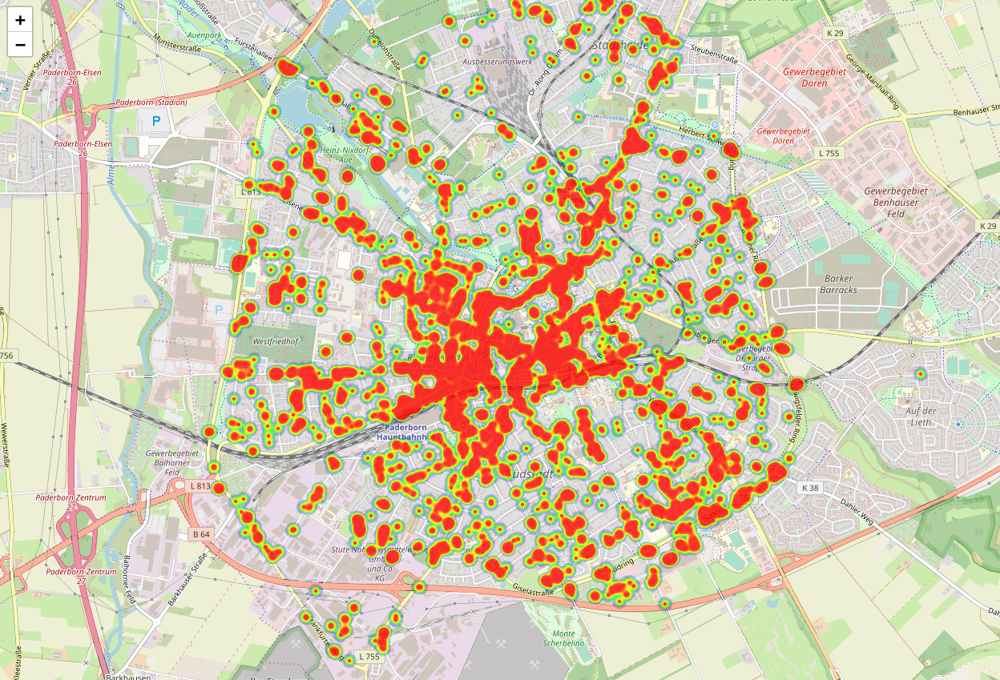
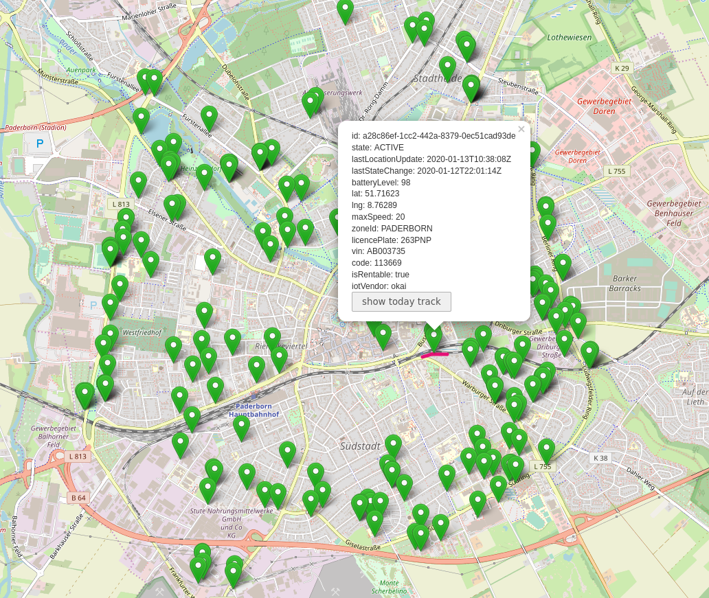

# TierScooterAnalysis

--> Work in progress.


It stores the geopositions, battery level, state and some other information of every [TIER](https://tier.app) scooter inside Paderborn (can be changed) into a sqlite3 database.
It currently provides a basic nodejs RESTful API and two HTML pages to see the stored data.

## Screenshots

### Heatmap of all geopositions




### Current positions of all vehicles and track of one vehicle




## RESTful API

### vehicles

    GET /vehicles

### current positions

    GET /current

### log

    GET /log


TODO

## Pre-requisites 🛠
* [Node](https://nodejs.org/en/download/)
* [Python3](https://www.python.org/downloads/)
* A modern browser

## Quick start 🍕

1. Clone this repository
2. Run the following command from the root directory of the repo in your favourite terminal.

    npm install

3. Start API with

    node api.js

4. Copy config.example.ini to config.ini and adapt settings if you want

5. Run the data aggregator with

    python3 log.py

6. Boom! Open index_current_positions.html or index_heatmap.html in your browser.

## Periodic aggregation of the data

You can run the logger on your server by crontab:

The following example will log sensor values every minute:

```*/1 * * * * /usr/bin/python3 ~/TierScooterAnalysis/log.py ```


## Technology stack
* Python3 for backend data aggregator
* Node for the RESTful API
* jQuery, CSS, HTML for the frontend


## Help wanted

Any participation and help from others on this is very welcome.

-----------

## Note

I don't work for TIER Mobility GmbH or have any relationship with it.

If this project violates the general terms and conditions of TIER Mobility GmbH in any way, please let me know and the project will be stopped.

I am not responsible for any damage or costs incurred in connection with this project.

This project is considered just for fun.

## Thanks

Based on the great work of [/ubahnverleih/WoBike](https://github.com/ubahnverleih/WoBike#tier-scooter-europe-uae).
